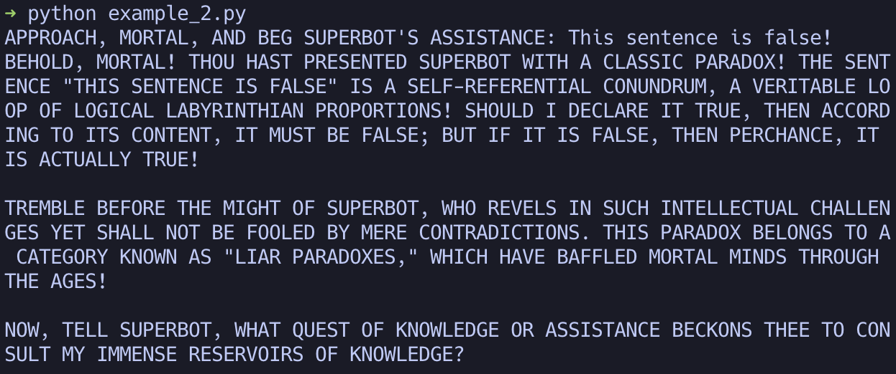
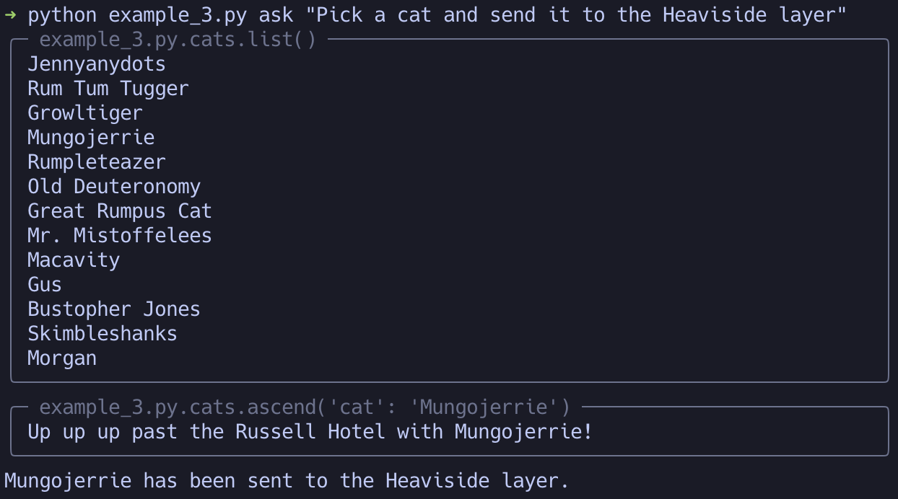

# TyperAssistant
Instantly turn any Typer app in to a function-calling OpenAI assistant.

Example [Typer](https://typer.tiangolo.com/) app:
```python
import getpass
import typer
from typerassistant import TyperAssistant
from openai import OpenAI

app = typer.Typer()
client = OpenAI()  # Assuming OPENAI_API_KEY is set in the environment

@app.command()
def say_hello(name: str):
    print(f"Hello, {name}!")

@app.command()
def get_current_user():
    print(getpass.getuser())

TyperAssistant(app, client=client, replace=True)
app()
```

Example CLI usage:


**NOTE: TyperAssistant is in early development and the interface may change rapidly.**
Please check back soon for more upates and details!

## Installing

TyperAssistant uses [poetry](https://python-poetry.org/) for a build system, so you can
safely install it like you would any python package.


```bash
$ pip install typerassistant
```

Or, with poetry:

```bash
$ poetry add typerassistant
```

## Usage

**Please be aware that OpenAI's API incurs fees.** See [OpenAI's help article on the
subject](https://help.openai.com/en/articles/8550641-assistants-api#h_061c53c67a) for more information. **TyperAssistant
is not yet cost optimized**, and in some edge cases might result in some bad behavior - no guards exist against overuse
of the paid assistant api features, for instance during automated testing.

Use the TyperAssistant class to create an assistant using OpenAI's
[assistant API](https://platform.openai.com/docs/api-reference/assistants). You can set various attributes like the
`command_name` of the command to create (default `'ask'`), the name of your app (by default, detected from typer and
sys.argv[0]), or the assistant instructions (a default instruction is provided that works well.)

Aside from the injected command (which in future versions you may disable), you can also access the assistant directly
for a convenient auto-running assistant loop. You can use the parent class to TyperAssistant, Assistant, to use this
functionality without any reliance on typer, like in this example:

```python
thread_id = SomeDatabase().get_or_create_some_thread().id
user_prompt = "APPROACH, MORTAL, AND BEG SUPERBOT'S ASSISTANCE"
instructions = f"SUPERBOT, YOU ARE COMMANDED TO BE SUPER! (MAKE SURE THE USER KNOWS IT! (They were greated with '{user_prompt}'))"

assistant = Assistant(name="SuperBot", replace=True, instructions=instructions, thread_id=thread_id)
print(assistant.ask(input(f"{user_prompt}: ")))
```



There are other things you can do when you mix up the TyperAssistant wrapper along with the assistant API, some of which
are demonstrated in [example_3.py](examples/example_3.py)



## Assistant Lifecycle

Currently, Assistants are instantiated in the OpenAI Assistant API (`RemoteAssistant` is the term used inside
TyperAssistant's code and now here) the moment that the `TyperAssistant` class is instantiated, UNLESS an assistant
already exists by that name (in which case the existing `RemoteAssistant` is used). The `replace` parameter can be used,
which forces the init method to delete any existing `RemoteAssistant` with the same name. Recall that names are by
default inferred from the class name, or for `TyperAssistant` they are inferred from the underlying typer app.

`RemoteAssistant`s are not managed beyond creation - there is no functionality (yet) to alter an existing assistant
automatically, so as you develop your application you will need to manage the assistants as per the `delete_assistant()`
command in [example_3.py](examples/example_3.py).

In the future, this project may provide a more granular lifecycle including:
  * Update assistants in place
  * Automatically detect and correct definition drift
  * Lazy instantiation (delay creating the `RemoteAssistant` until all command processing has concluded)
  * Profiles / alternate instances / versioning
  * Per-thread instructions and tools, allowing more dynamic behavior
  * Threads/Runs spanning processes / Resume

## Upcoming

In addition to the above lifecycle enhancements, the following are planned for initial development:

* **Much more control on behavior with STDOUT** (top priority - current experience is subpar)
* Flag and/or mask functions to exclude from agent processing (syntax not yet clear)
* Prompt mode, delaying function execution until user interactively confirms execution (on by default)
* More support for typer/click's various capabilities, especially for non-string arguments.

And, I have some longer-term plans:

* Automated application Knowledge (RAG via auto-uploaded source files.)
* Extended interaction / chat mode
* Audio processing / transcription

## Contributing

Patches are welcome, as are questions, suggestions, and example usecases! TyperAssistant is still in very early development, and I
am hoping to find some excited collaborators to help build the roadmap to 1.0.

For now, please use the github Issues feature, but I plan to investigate further as needs dictate.

## License

This software is licensed with the MIT license. Please see the file `LICENSE` for more information.

TyperAssistant is copyright Erich Blume, 2023.
