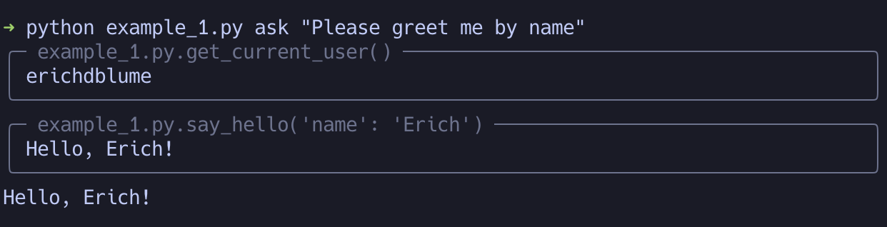

# TyperAssistant
Instantly turn any python Typer CLI in to a function-calling OpenAI assistant.

Example [Typer](https://typer.tiangolo.com/) app:
```python
import getpass
import typer
from typerassistant import register_assistant

app = typer.Typer()
register_assistant(app)

@app.command()
def say_hello(name: str):
    print(f"Hello, {name}!")

@app.command()
def get_current_user():
    print(getpass.getuser())

if __name__ == "__main__":
    app()
```

Example CLI usage:



## Installing

TyperAssistant uses [poetry](https://python-poetry.org/) for a build system, so you can
safely install it like you would any python package.


```bash
$ pip install typerassistant
```

Or, with poetry:

```bash
$ poetry add typerassistant
```

## Usage

**Please be aware that OpenAI's API incurs fees.** See [OpenAI's help article on the
subject](https://help.openai.com/en/articles/8550641-assistants-api#h_061c53c67a) for more information.

A documentation pass is planned before the 1.0 release, but at this time the best way to learn how to use
TyperAssistant's features is to go check out the `examples/` directory. You can also see that the main `typerassistant`
package only exports three members:

* `Assistant`, a basic frontend for OpenAI's Assistant API that handles function calling and threads.
* `TyperAssistant`, an `Assistant` subclass which wraps a Typer application.
* `register_assistant(app: Typer)`, a function which registers an "ask" command and automatically generates an
    appropriate assistant for your application.

**Most use cases require only `register_assistant(app)` to begin working immediately!**

## Contributing

Patches are welcome, as are questions, suggestions, and example usecases! TyperAssistant is still in very early development, and I
am hoping to find some excited collaborators to help build the roadmap to 1.0.

For now, please use the github Issues feature, but I plan to investigate further as needs dictate.

## License

This software is licensed with the MIT license. Please see the file `LICENSE` for more information.

TyperAssistant is copyright Erich Blume, 2024.
